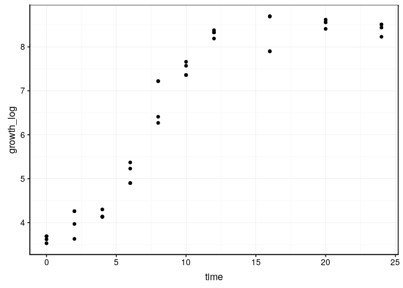

La croissance bactérienne
================

## Contexte

Des scientifiques ont réalisé une culture bactérienne. Ils tentent de
modéliser la croissance bactérienne mais n’ont pas vos connaissances
afin d’y arriver. Aidez les scientifiques à modéliser les données qu’ils
ont obtenus.

``` r
bacteria <- read("data/growth_curve.tsv")
```

    ## Parsed with column specification:
    ## cols(
    ##   time = col_double(),
    ##   growth_log = col_double()
    ## )

``` r
chart(bacteria, growth_log ~ time) +
  geom_point()
```

<!-- -->

## Objectif

Réalisez un cahier de laboratoire afin de mettre en avant le meilleur
modèle pour modéliser la croissance bactérienne qui vous est proposée.
Le jeu de données est mis à votre disposition dans le dossier `data` .

Justifiez le choix du meilleur modèle
